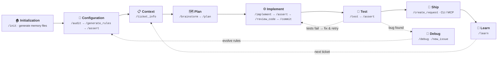
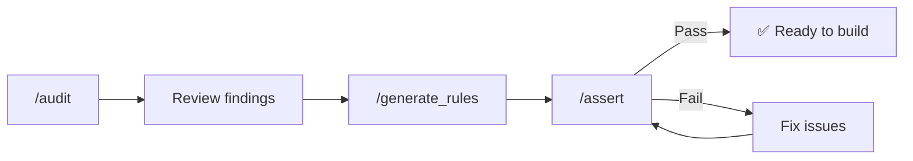
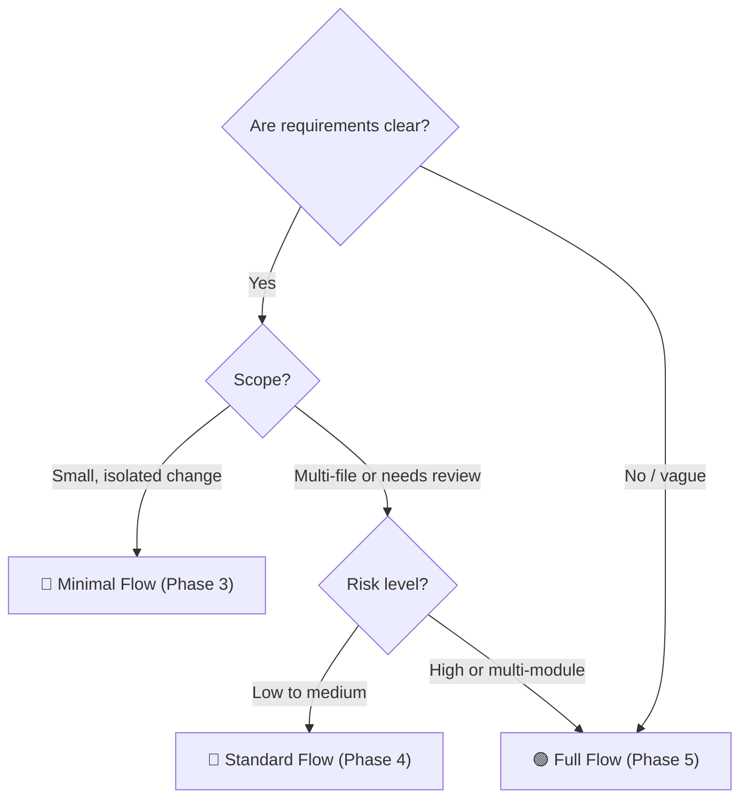
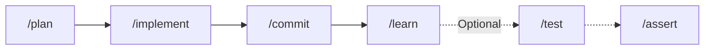
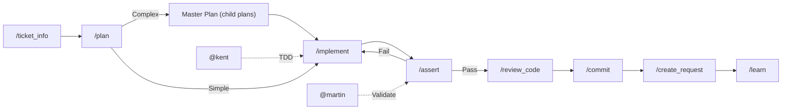
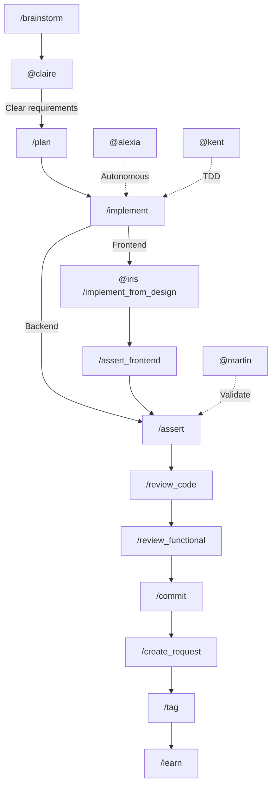
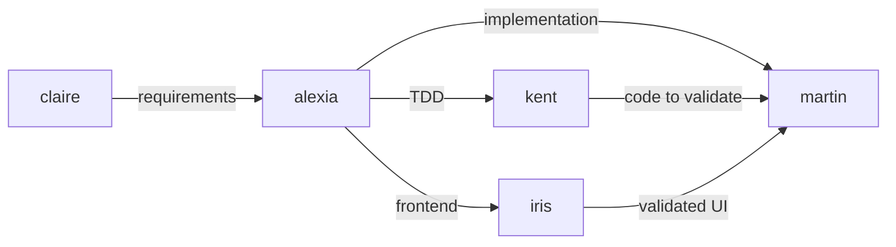
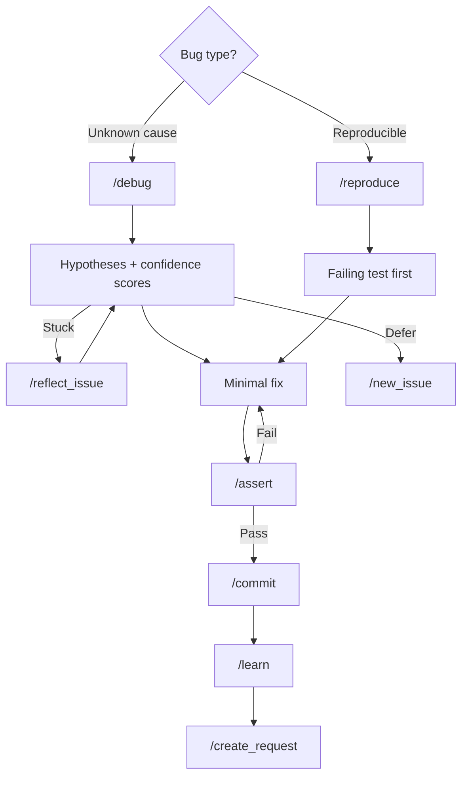

# AI-Driven Dev Docs

AIDD structures your AI coding assistant with commands, agents, rules, and memory so it produces consistent, high-quality code. This guide takes you from setup to autonomous workflows in a progressive learning path.

- [📦 What You Get](#-what-you-get)
  - [Concepts](#concepts)
  - [Framework Structure](#framework-structure)
  - [Your AI-Driven Dev path](#your-ai-driven-dev-path)
- [🏗️ Phase 1 — Setup \& Initialization](#️-phase-1--setup--initialization)
  - [Step by Step](#step-by-step)
- [⚙️ Phase 2 — Configure Your Project](#️-phase-2--configure-your-project)
  - [Step by Step](#step-by-step-1)
  - [Which Flow Should I Use?](#which-flow-should-i-use)
- [🔺 Phase 3 — Minimal Flow](#-phase-3--minimal-flow)
  - [The 4-Command Loop](#the-4-command-loop)
  - [Step by Step](#step-by-step-2)
- [🔷 Phase 4 — Standard Flow](#-phase-4--standard-flow)
  - [When to Use Standard Flow](#when-to-use-standard-flow)
  - [Step by Step](#step-by-step-3)
  - [Working with Tickets](#working-with-tickets)
  - [Review and Ship](#review-and-ship)
  - [Master Plans](#master-plans)
  - [Meet `@martin` and `@kent`](#meet-martin-and-kent)
- [🟢 Phase 5 — Full Flow](#-phase-5--full-flow)
  - [Step by Step](#step-by-step-4)
  - [Frontend Toolkit](#frontend-toolkit)
  - [Autonomous Mode](#autonomous-mode)
- [🔧 Phase 6 — Maintenance \& Evolution](#-phase-6--maintenance--evolution)
  - [Fix a Bug](#fix-a-bug)
  - [Refactor \& Improve](#refactor--improve)
  - [Architecture Validation](#architecture-validation)
  - [Documentation](#documentation)
  - [Evolve Your Framework](#evolve-your-framework)
- [✅ Validation Rules](#-validation-rules)
- [📚 References](#-references)

## 📦 What You Get

When you install AIDD, your project gets a ready-to-use framework: 40 slash commands, 5 specialized agents, coding rules, and a memory system — all pre-configured. You just type commands like `/plan`, `/implement`, `/commit` and the AI follows structured workflows instead of guessing.

This structure has been designed to be **scalable**, **standardized**, and **fully customizable** across any project. Every command, agent, and rule is built from templates you can adapt to your needs. It's the result of two years of experimentation on real codebases.

### Concepts

The framework is built on 6 building blocks:

| Block        | Location                 | What it does                                            |
| ------------ | ------------------------ | ------------------------------------------------------- |
| 🧠 Memory    | `aidd_docs/memory/`       | Project context read by AI on every conversation        |
| 💬 Commands  | `/plan`, `/implement`... | Slash commands triggering structured workflows          |
| 🤖 Agents    | `@martin`, `@kent`...    | Specialized AI personas for focused tasks               |
| 📏 Rules     | Auto-loaded by glob      | Coding standards the AI follows automatically           |
| 🔧 Skills    | Context-matched          | Reusable workflows loaded when context matches          |
| 📐 Templates | `aidd_docs/templates/`    | Scaffolding to generate agents, commands, rules, skills |

> See the [Full catalog](CATALOG.md) — exhaustive list of all commands, agents, rules, skills

#### Commands structure

We have decided to put those into categories that serve the **Software Development Lifecycle** (`SDLC`).

| Phase | Category      | Examples                                               |
| ----- | ------------- | ------------------------------------------------------ |
| 01    | Onboard       | Framework setup, generators, prompt scaffolding        |
| 02    | Context       | Discovery, PRD, user stories, brainstorming, flows     |
| 03    | Plan          | Technical planning, component behavior, image analysis |
| 04    | Code          | Implementation, assertions, frontend validation        |
| 05    | Review        | Code review, functional review                         |
| 06    | Tests         | Test writing, user journey testing, untested listing   |
| 07    | Documentation | Learning, JIRA info, Mermaid diagrams                  |
| 08    | Deploy        | Commits, pull/merge requests, tagging                  |
| 09    | Refactor      | Performance optimization, security refactoring         |
| 10    | Maintenance   | Debugging, issue tracking, codebase audits             |

> See more here: [CATALOG.md](CATALOG.md) — the 10 phases from Onboard to Maintenance

### Framework Structure

AIDD installs alongside your code. Commands, agents, and rules go into your IDE's configuration directory (`.claude/`, `.cursor/`, or `.github/`). Documentation and memory go into `aidd_docs/`.

```text
my-project/
├── .claude/                 # ⚙️ Claude Code (commands, agents, rules, skills)
├── .cursor/                 # ⚙️ Cursor (commands, agents, rules, skills)
├── .github/                 # ⚙️ GitHub Copilot (prompts, agents, instructions)
├── aidd_docs/
│   ├── memory/              # 🧠 Your project context (generated by /init)
│   │   ├── internal/        #   Internal docs (API specs, DB schema, design...)
│   │   └── external/        #   External documentation
│   ├── tasks/               # 📋 Implementation plans and task tracking
│   ├── templates/           # 📐 Scaffolding templates
│   │   ├── aidd/            #   Agent, command, rule, skill, plan templates
│   │   ├── dev/             #   ADR, code review, decision, tech choice
│   │   ├── pm/              #   Brief, PRD, persona, user story, milestones
│   │   └── vcs/             #   Commit, PR, branch, issue, release
│   ├── CATALOG.md           # 📦 Full reference of all commands, agents, rules, skills
│   ├── README.md
│   └── CONTRIBUTING.md
├── src/                     # 📁 Your application code
│   ├── controllers/
│   ├── services/
│   ├── repositories/
│   └── models/
├── tests/
└── package.json

```

### Your AI-Driven Dev path

This guide follows a progressive structure. Each phase builds on the previous one and introduces new commands as they become relevant.



Start at **Initialization**, then follow the path step by step. Each box shows the key commands you'll use at that stage.

## 🏗️ Phase 1 — Setup & Initialization

> **New commands:** `/init`

### Step by Step

1. Install the AI-Driven Development framework using the [CLI](https://github.com/ai-driven-dev/aidd-cli) or by copying the dist files to your project root.

2. Analyze your project and generate memory files.

   ```text
   /init
   # → Generated 7 memory files in aidd_docs/memory/
   ```

   | 📄 File                | 🎯 Purpose                                  |
   | ---------------------- | ------------------------------------------- |
   | `project_brief.md`     | Vision, objectives, what the project does   |
   | `architecture.md`      | Tech stack, patterns, folder structure      |
   | `codebase_map.md`      | Key files, entry points, dependencies       |
   | `coding_assertions.md` | Linting, formatting, type checking commands |
   | `testing.md`           | Test framework, patterns, coverage targets  |
   | `deployment.md`        | CI/CD, environments, infrastructure         |
   | `vcs.md`               | Branching model, commit conventions         |

   The AI reads these files on every conversation start — accurate context means better code.

3. **Review and manually correct** each generated file in `aidd_docs/memory/`. The AI gives you a solid first draft, but you know your project best. The more accurate your memory files, the better every command performs.

Your AI knows the project. But it doesn't know your conventions yet. Before building anything, configure the rules.

## ⚙️ Phase 2 — Configure Your Project

> **New commands:** `/audit`, `/generate_rules`, `/assert`



### Step by Step

1. Deep analysis of your codebase — identifies technical debt, inconsistencies, and improvement opportunities.

   ```text
   /audit
   # → 12 findings: 3 critical, 5 warnings, 4 suggestions
   ```

2. Create rules the AI will follow automatically. Rules are auto-loaded by file glob matching.

   ```text
   /generate_rules "We use camelCase for variables, PascalCase for components, and barrel exports for every module"
   # → Created 3 rules in .claude/rules/
   ```

3. Verify everything works — tests pass, types check, build succeeds, linter is clean. This becomes your safety net throughout the entire workflow.

   ```text
   /assert
   # → Tests ✅, Types ✅, Build ✅, Lint ✅
   ```

Your project is configured, assertions pass. Now pick the right workflow for your task.

#### Where will rules be stored?

> See full [CATALOG.md](CATALOG.md) — the 10 rule directories from Architecture to Other

| #    | Category                   | Content                     | Examples                        |
| ---- | -------------------------- | --------------------------- | ------------------------------- |
| `00` | `architecture`             | System-level code patterns  | Clean, Hexagonal, API design    |
| `01` | `standards`                | Code style, naming          | camelCase, imports              |
| `02` | `programming-languages`    | Language-specific rules     | TypeScript strict mode          |
| `03` | `frameworks-and-libraries` | Framework/lib code patterns | React hooks, Prisma, Express    |
| `04` | `tooling`                  | Tool/infra configuration    | ESLint, Docker, Webpack, CI/CD  |
| `05` | `testing`                  | Test code patterns          | Structure, fixtures, mocking    |
| `06` | `design-patterns`          | Code design patterns        | Repository, Factory, Observer   |
| `07` | `quality`                  | Perf & security in code     | Caching, auth patterns, headers |
| `08` | `domain`                   | Business logic code         | Validation, entities, DTOs      |
| `09` | `other`                    | Miscellaneous               | Edge cases                      |

### Which Flow Should I Use?

Before jumping into a feature, pick the flow that matches your situation. Each flow is a phase in this guide — read the one you need and skip the rest.



| Flow            | When to use                                             | Key commands                                                   |
| --------------- | ------------------------------------------------------- | -------------------------------------------------------------- |
| **🔺 Minimal**  | Clear task, small scope, no review needed               | `/plan` → `/implement` → `/commit` → `/learn`                  |
| **🔷 Standard** | Ticket-driven, needs validation and review              | + `/ticket_info`, `/assert`, `/review_code`, `/create_request` |
| **🟢 Full**     | Vague requirements, complex feature, frontend precision | + `/brainstorm`, agents (`@claire`, `@iris`, `@alexia`)        |

## 🔺 Phase 3 — Minimal Flow

> **New commands:** `/plan`, `/implement`, `/commit`, `/learn`, `/test`

The fastest path from idea to committed code. Use this when requirements are clear and the scope is small.

### The 4-Command Loop



### Step by Step

1. Describe your task — pass a description, a GitHub issue URL, or raw requirements.

   ```text
   /plan "Add a rate limiter to the /api/auth endpoint"
   # → aidd_docs/tasks/add-rate-limiter.md
   ```

2. Implement the plan phase by phase. The AI reads the plan and follows your project rules.

   ```text
   /implement
   # Reads aidd_docs/tasks/add-rate-limiter.md, implements phase by phase
   ```

3. Commit with a standardized message following your `vcs.md` conventions.

   ```text
   /commit
   # → feat(auth): add rate limiter to /api/auth endpoint
   ```

4. Capture what changed — routes knowledge to memory files, rules, or skills automatically.

   ```text
   /learn "We now use middleware-based rate limiting with Redis backing"
   # → Updated memory/architecture.md
   ```

5. (Optional) Add tests — lists untested behaviors then iterates on test creation until green.

   ```text
   /test
   # → Lists untested behaviors, creates tests, iterates until green
   ```

> **When to stop:** If `/plan` returns < 90% confidence → re-run with more context. If `/implement` fails after 3 iterations → debug manually. If needs review → Phase 4.

The 4-command loop handles clear, small tasks. When you need validation, review, or team collaboration, level up.

## 🔷 Phase 4 — Standard Flow

> **New commands:** `/ticket_info`, `/new_issue`, `/create_user_stories`, `/review_code`, `/create_request`
> **New agents:** `@martin`, `@kent`

The standard workflow for ticket-driven development. Adds validation, code review, and collaboration on top of the minimal loop.

### When to Use Standard Flow

- Task comes from a ticket or issue
- Changes span multiple files
- A pull request is expected
- Code quality matters (review, assertions)



### Step by Step

1. Pull context from your ticketing tool (GitHub, Jira, Linear). Pass a URL or ticket number.

   ```text
   /ticket_info "https://github.com/org/repo/issues/42"
   # → Extracted: title, acceptance criteria, labels, assignees
   ```

2. Generate a plan from the ticket context.

   ```text
   /plan
   # → aidd_docs/tasks/add-rate-limiter.md (reads ticket context)
   ```

3. Implement the plan phase by phase — `/assert` runs between each.

   ```text
   /implement
   # Implements phase by phase, runs /assert between each
   ```

4. Validate the codebase with `@martin`.

   ```text
   @martin Run all assertions on the current changes.
   # → Build ✅, Tests ✅, Lint ✅, Types ✅
   ```

5. Review the diff against project rules.

   ```text
   /review_code
   # → 2 issues: missing error handling in middleware, naming convention on variable
   ```

6. Commit with a standardized message.

   ```text
   /commit
   # → feat(auth): add rate limiter to /api/auth endpoint
   ```

7. Create a pull request with a filled template.

   ```text
   /create_request
   # → PR #43 created (draft) with filled template
   ```

### Working with Tickets

- **`/new_issue`** — Create a GitHub issue with interactive template filling. Use this to defer work you discover mid-feature.

- **`/create_user_stories`** — Generate user stories through iterative questioning. Useful when a ticket is too high-level for direct planning.

### Review and Ship

- **`/review_code`** — Analyze the git diff against project rules. Catches convention violations, potential bugs, and structural issues before the PR.

- **`/create_request`** — Create a draft PR (GitHub) or MR (GitLab) with a filled template.

### Master Plans

When `/plan` evaluates a feature as complex (complexity score >= 3), it produces a **master plan** that decomposes the work into sequential child plans. Each child plan uses the standard plan template and must be validated before the next one starts.

```text
aidd_docs/tasks/
├── feature-x-master-plan.md     # Parent plan: overview, risk score, child plan list
├── feature-x-part-1.md          # Child plan 1 (implement first, validate, then...)
├── feature-x-part-2.md          # Child plan 2 (blocked until part 1 validated)
└── feature-x-part-3.md          # Child plan 3 (blocked until part 2 validated)
```

Execution is sequential: each child plan must pass `/assert` before the next one starts.

### Meet `@martin` and `@kent`

Agents are specialized AI personas you invoke for focused tasks. They loop on their task until completion.

- **`@martin`** — Code quality and validation agent. Call Martin every time you need to verify the codebase still builds, tests pass, and coding rules are respected.

- **`@kent`** — TDD and Tidy First agent. Call Kent when you want strict Red → Green → Refactor discipline. He separates structural changes from behavioral changes.

```text
@kent Write tests for the UserService class, then implement the missing methods using TDD.
# → Red: 3 failing tests → Green: all pass → Refactor: extracted helper
```

> **When to stop:** If `/assert` fails after 5 cycles → `/debug` (Phase 6). If `/review_code` finds structural issues → refactor first. If the plan keeps getting rejected → `/brainstorm` (Phase 5).

Standard flow gets you productive. For vague requirements, multi-module features, or frontend precision, you need the full arsenal.

## 🟢 Phase 5 — Full Flow

> **New commands:** `/brainstorm`, `/challenge`, `/components_behavior`, `/image_extract_details`, `/implement_from_design`, `/assert_frontend`, `/review_functional`, `/test_journey`, `/tag`, `/run_projection`
>
> **New agents:** `@claire`, `@iris`, `@alexia`

The complete workflow for complex features. Adds discovery, frontend-specific tools, functional review, and autonomous execution.



### Step by Step

1. Clarify requirements — `@claire` challenges until the request is precise.

   ```text
   @claire I want to add a notification system to the app.
   # → 5 clarifying questions: channels, triggers, user preferences, persistence, edge cases
   ```

2. Explore options before planning.

   ```text
   /brainstorm
   # → 3 approaches compared: WebSocket push, SSE, polling
   ```

3. Plan the feature.

   ```text
   /plan
   # → aidd_docs/tasks/add-notifications.md
   ```

4. Implement — backend with `/implement`, frontend with `@iris` from design.

   ```text
   @iris Implement the notification preferences panel from this Figma frame.
   # → Component created with responsive layout, pixel-perfect match
   ```

5. Assert frontend behavior.

   ```text
   /assert_frontend
   # → Visual match ✅, interactions ✅, responsive ✅
   ```

6. Review — code quality and functional validation.

   ```text
   /review_code
   # → 1 issue: missing error boundary on notification list
   ```

   ```text
   /review_functional
   # → Screenshots captured, all steps match plan ✅
   ```

7. Ship — commit, pull request, tag.

   ```text
   /commit
   # → feat(notifications): add user notification preferences
   ```

   ```text
   /create_request
   # → PR #44 created (draft) with filled template
   ```

   ```text
   /tag v1.3.0
   # → Tag v1.3.0 created and pushed
   ```

### Frontend Toolkit

These commands are available for frontend-specific workflows:

- **`/components_behavior`** — Define component behavior as state machines
- **`/image_extract_details`** — Extract components, spacing, colors from a design image
- **`/implement_from_design`** — Implement a component from Figma with pixel-perfect accuracy
- **`/assert_frontend`** — Visual and behavioral validation of frontend features
- **`/test_journey`** — Test a complete user journey end-to-end in the browser

### Autonomous Mode

**`@alexia`** — Autonomous end-to-end implementation agent. She implements entire features from request to completion without asking questions.

```text
@alexia Implement the user notification preferences page based on issue #42.
# → Full implementation: plan → code → tests → commit → PR (no questions asked)
```

Use Alexia for well-defined features when you want minimal supervision. If she produces non-conforming code after 3 iterations, switch back to guided mode.

> **Parallel work:** Use `/run_projection` to preview a proposed solution before committing to it.



> **When to stop:** If `/brainstorm` cannot clarify requirements → involve a human. If `@alexia` produces non-conforming code after 3 iterations → switch to guided mode. If `@claire` loops → the problem needs human decision-making.

Features ship. Software lives. Bugs, tech debt, security, and framework evolution — here's how to handle them.

## 🔧 Phase 6 — Maintenance & Evolution

> **New commands:** `/debug`, `/reproduce`, `/reflect_issue`, `/performance`, `/security_refactor`, `/assert_architecture`, `/mermaid`, `/generate_agent`, `/generate_command`, `/generate_skill`, `/generate_architecture`

### Fix a Bug



1. Identify the bug type and start investigating.

   ```text
   /debug
   # → 3 hypotheses: race condition (85%), missing null check (60%), stale cache (30%)
   ```

   ```text
   /reproduce
   # → Failing test created: "should reject concurrent auth requests"
   ```

2. If stuck, step back and reflect.

   ```text
   /reflect_issue
   # → New angle: check middleware ordering — rate limiter runs after auth
   ```

3. Apply the fix, validate, and ship.

   ```text
   /assert
   # → Tests ✅, Types ✅, Build ✅, Lint ✅
   ```

   ```text
   /commit
   # → fix(auth): resolve race condition in rate limiter middleware
   ```

4. If low-priority, defer to a new issue.

   ```text
   /new_issue
   # → Issue #45 created: "Investigate edge case in concurrent token refresh"
   ```

> **When to stop:** If `/debug` exhausts all hypotheses → `/reflect_issue` for a fresh perspective. If still stuck → `/new_issue` to defer and move on.

### Refactor & Improve

- **`/audit`** — Re-run at any time to assess current technical debt and find improvement opportunities.

- **`/performance`** — Optimize code for better performance. Identifies bottlenecks and applies targeted optimizations.

  ```text
  /performance
  # → 3 bottlenecks found: N+1 query, missing index, unoptimized loop
  ```

- **`/security_refactor`** — Identify and fix security vulnerabilities following OWASP guidelines.

### Architecture Validation

- **`/assert_architecture`** — Verify that code conforms to architecture diagrams, ADRs, and project structure. Use after refactors or when onboarding to verify structural integrity.

  ```text
  /assert_architecture
  # → 2 violations: circular dependency in services/, missing ADR for cache layer
  ```

- **`/assert_frontend`** — Validate frontend-specific architecture and component structure.

### Documentation

- **`/learn`** — Capture new patterns, decisions, or conventions into memory, rules, or skills.

- **`/mermaid`** — Generate Mermaid diagrams to document architecture, flows, or data models.

  ```text
  /mermaid
  # → Generated sequence diagram in aidd_docs/memory/architecture.md
  ```

### Evolve Your Framework

The framework itself is customizable. Use these commands to extend it as your project grows.

| Command                  | Creates                                 | When                                           |
| ------------------------ | --------------------------------------- | ---------------------------------------------- |
| `/generate_rules`        | Coding rules (auto-loaded by file glob) | Project has conventions to enforce             |
| `/generate_agent`        | Specialized AI persona                  | Recurring behavioral loop needed               |
| `/generate_command`      | Custom slash command                    | One-off action you repeat often                |
| `/generate_skill`        | Reusable workflow package               | Pattern repeats 2-3x with 90%+ identical steps |
| `/generate_architecture` | Full project architecture               | New project or major restructuring             |

An agent defines _who_ does the work (role, scope, behavior). A skill defines _how_ to do the work (workflow, conventions, scripts). Agents can load skills; skills can be used by multiple agents.

All commands, agents, and rules are built from templates in `aidd_docs/templates/aidd/`. You can edit any generated file directly to adapt it to your project. The templates serve as scaffolding — once generated, the output is yours to modify.

See [CONTRIBUTING.md](CONTRIBUTING.md) for guidelines on modifying or contributing to the framework.

## ✅ Validation Rules

- **Never implement a plan with < 90% confidence.** If the plan is uncertain, go back to `/plan`.
- **`/assert` after every implementation phase.** Tests, types, build, lint must pass.
- **Max 3-5 iterations** before escalating to human. AI loops have guardrails.
- **Separate structural from behavioral changes.** Different commits for refactoring vs. new behavior.

## 📚 References

- [`CATALOG.md`](CATALOG.md) — Full reference: all commands, agents, rules, skills, and templates.
- [`CONTRIBUTING.md`](CONTRIBUTING.md) — Guidelines for adding or modifying content.
- [Agents Coordination](templates/aidd/agents_coordination.md) — Multi-agent workflows and communication flow.
