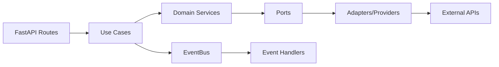
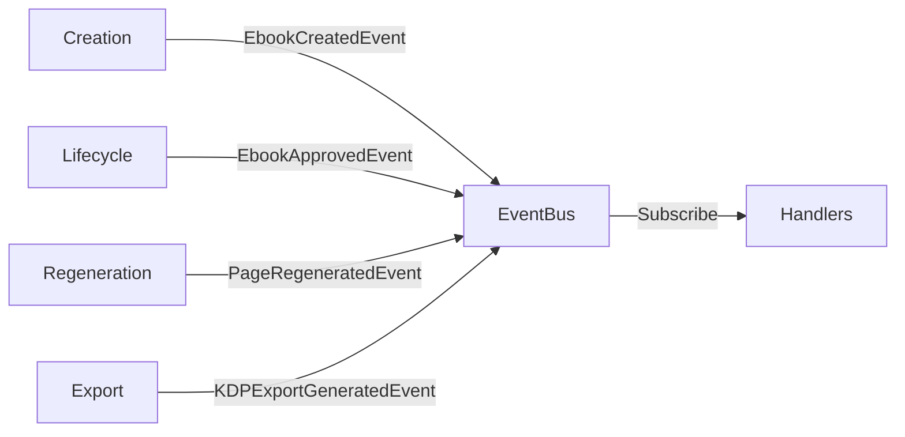
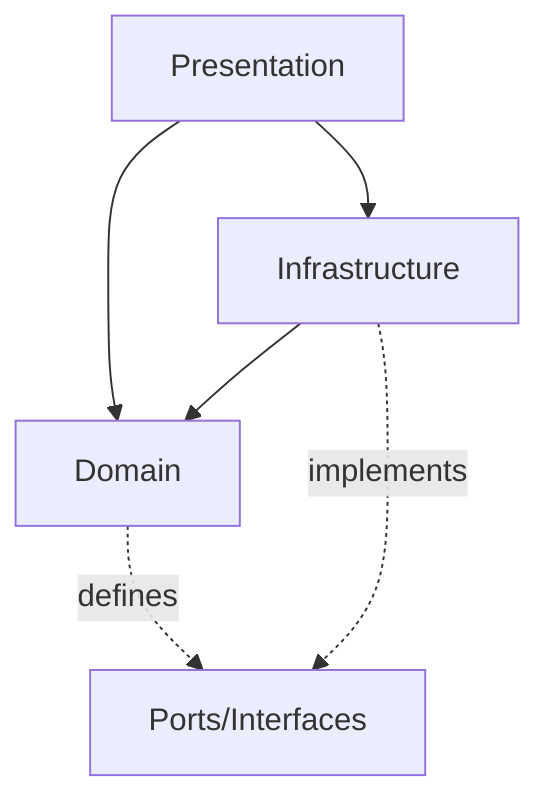

# Architecture

## Backend

@pyproject.toml

### Core Framework
- Python 3.13
- FastAPI 0
- Pydantic 2
- Uvicorn (ASGI server)

### Architecture & Patterns
- Hexagonal (Ports & Adapters)
- DDD (Domain-Driven Design)
- Event-Driven (EventBus with asyncio)
- Feature-Based (Screaming Architecture)
- Dependency Inversion
- CQRS-lite: Separation of command use cases and query services

### Database
- PostgreSQL
- SQLAlchemy 2 (sync only)
- Alembic 1 (migrations) → @src/backoffice/migrations/

### Templating & Web
- Jinja2 3 (ChoiceLoader for multi-feature templates)
- HTMX (frontend interactivity)
- TailwindCSS (styling)

### AI & Image Processing
- openai 1 (OpenRouter SDK)
- httpx 0 (HTTP client for external APIs)
- Pillow 10 (image manipulation)
- img2pdf 0 (PDF generation)
- WeasyPrint 61 (HTML/CSS to PDF)
- ImageCms (ICC profile conversion)

### Configuration & Utilities
- PyYAML 6 (business limits, KDP specs, branding, and theme configuration via ConfigLoader)
- python-dotenv 1 (environment variables)
- python-multipart 0 (file uploads)
- aiofiles 23 (async file I/O)

### Code Quality
- ruff 0 (linting & formatting) → @pyproject.toml
- mypy 1 (type checking) → @pyproject.toml
- vulture 2 (dead code detection) → @pyproject.toml
- deptry 0 (dependency analysis) → @pyproject.toml
- pre-commit 3 (git hooks) → @.pre-commit-config.yaml

### External Services Integration
- google-api-python-client 2 (Google Drive)
- google-auth 2 (service account)
- websocket-client (ComfyUI WebSocket)

### Image Generation Providers
Located at @features/ebook/shared/infrastructure/providers/images/
- OpenRouter (Gemini 2.5 Flash via OpenRouter API)
- Gemini Direct (Google Gemini API)
- ComfyUI (local Stable Diffusion via WebSocket)
- Diffusers (local SDXL via HuggingFace diffusers library)

### Publishing Providers
Located at @features/ebook/shared/infrastructure/providers/publishing/kdp/
- Interior Assembly → @assembly/interior_assembly_provider.py
- Cover Assembly → @assembly/cover_assembly_provider.py
- KDP Utils → @utils/
  - Barcode Utils → @barcode_utils.py
  - Spine Generator → @spine_generator.py
  - Color Utils → @color_utils.py (RGB→CMYK with ICC profiles)
  - Visual Validator → @visual_validator.py

## Frontend

@frontend/package.json

### Core Framework
- React 19
- Vite 7 (build tool + dev server, port 3000)
- TypeScript 5 (strict mode)

### State Management & Routing
- Redux Toolkit 2
- React Redux 9
- React Router 7 (client-side routing)

### Styling
- Tailwind CSS 4 (Vite plugin)

### Testing
- Vitest 3 (jsdom environment)

### Code Quality
- ESLint 9

### Architecture & Patterns
- Hexagonal (Ports & Adapters) — mirrors backend
- Feature-Based (Screaming Architecture)
- Chicago-style testing (fakes over mocks)
- Gateway Injection via Redux `thunk.extraArgument`

## Data Flow Architecture



## Project Structure

```plaintext
src/backoffice/
   features/                    # All business features
      auth/                    # Authentication bounded context
      ebook/                   # Ebook domain (5 subdomains)
         creation/            # Create new coloring books
         lifecycle/           # Approve/reject workflow
         listing/             # Browse/filter ebooks
         regeneration/        # Regenerate pages/covers
         export/              # PDF/KDP export
         shared/              # Ebook-specific shared code
      shared/                  # Cross-feature shared kernel
   config/                      # App configuration loader
   migrations/                  # Alembic DB migrations
   main.py                      # FastAPI entry point
```

### Dual API Pattern

- Features expose both HTML routes (`routes.py`) and JSON API routes (`api.py`) in `presentation/routes/`
- HTML routes: return Jinja2 partials with `HX-Trigger` headers (HTMX)
- JSON API routes: return JSON responses for the React frontend
- Both coexist side-by-side -- no breaking changes to existing HTMX routes

## Communication

### Inter-Feature Communication



**Rules**:
- Features NEVER import from each other directly
- Communication ONLY via domain events through EventBus
- Shared code in `features/shared/` or `features/ebook/shared/`

## Layer Dependencies



- Domain has ZERO dependencies on infrastructure
- Ports defined in domain, implemented in infrastructure
- Presentation depends on domain and infrastructure

## Naming Conventions

### Backend

| Type | Pattern | Example |
|------|---------|---------|
| Use Cases | `VerbNounUseCase` | `ApproveEbookUseCase` |
| Ports | `NounPort` | `EbookPort`, `CoverPort` |
| Adapters | `TechnologyNounAdapter` | `SQLAlchemyEbookRepository` |
| Providers | `TechnologyNounProvider` | `OpenRouterImageProvider` |
| Domain Events | `NounVerbedEvent` | `EbookCreatedEvent` |
| Entities | `Noun` | `Ebook`, `ImagePage` |
| Files | `snake_case.py` | `approve_ebook_usecase.py` |
| Tests | `test_subject_scenario` | `test_approve_draft_ebook` |
| Fakes | `FakeNounPort` | `FakeCoverPort` |

### Frontend

| Type | Pattern | Example |
|------|---------|---------|
| Gateway interfaces | `NounGateway` | `EbookGateway` |
| HTTP implementations | `HttpNounGateway` | `HttpEbookGateway` |
| Use cases (thunks) | `verbNoun` | `listEbooks`, `createEbook` |
| Slices | `noun-slice.ts` | `ebook-slice.ts` |
| Selectors | `selectNoun` | `selectEbooks` |
| Components | `PascalCase.tsx` | `CreateEbookModal.tsx` |
| Fakes | `FakeNounGateway` | `FakeEbookGateway` |

## External Services

| Service | Purpose | Adapter |
|---------|---------|---------|
| PostgreSQL | Persistence | `SQLAlchemyEbookRepository` |
| OpenRouter | Image generation | `OpenRouterImageProvider` |
| Gemini | Image generation, text removal | `GeminiImageProvider` |
| ComfyUI | Local SD generation | `ComfyImageProvider` |
| Diffusers | Local SDXL generation | `DiffusersImageProvider` |
| Google Drive | PDF backup storage | `GoogleDriveStorageAdapter` |
| Google OAuth | Authentication | `AuthMiddleware` |

## Domain Services

| Service | Purpose |
|---------|---------|
| `CoverGenerationService` | Delegates cover generation to image provider ports |
| `CoverCompositor` | Overlays title/footer PNG images onto covers (Pillow) |
| `PageGenerationService` | Delegates content page generation |
| `RegenerationService` | Rebuilds PDF and uploads after page/cover regeneration |
| `ThemeRepository` | Loads and validates ThemeProfile from YAML files |

## Security

- Google OAuth 2.0 (session cookies, NOT JWT)
- `AuthMiddleware` checks session cookie (`backoffice_session`)
- Public routes: `/login`, `/auth/*`, `/static/*`, `/healthz`, `/__test__/`, `/assets/`
- Pydantic (input validation)
- SQLAlchemy ORM (SQL injection prevention)
- `CoverCompositor._validate_overlay_path()` rejects path traversal
- Defensive `DomainError` instead of bare `assert` in production code

## Frontend State

```
{
  ebooks: { items, currentEbook, stats, formConfig, pagination, statusFilter, loading, error }
  regeneration: { progress, editModal, pageData, preview }
}
```

- `ebook-slice`: CRUD, listing, stats, form config
- `regeneration-slice`: Image editing, preview, progress tracking, `restorePreview` reducer for undo
- Components access gateways ONLY via Redux thunks, never direct `fetch()`
