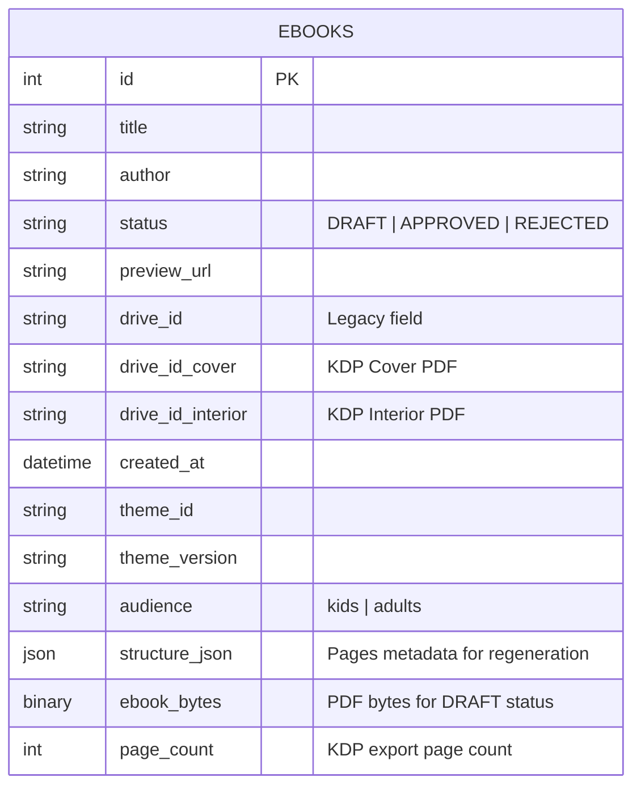

# Database

## Information

- **Schema path**: @src/backoffice/features/ebook/shared/infrastructure/models/
- **Type**: PostgreSQL
- **ORM/Driver**: SQLAlchemy 2 (sync), psycopg2-binary
- **Connection**: Via `DATABASE_URL` environment variable
- **Mode**: 100% synchronous (no async DB operations)

## Main Entities and Relationships

Single-table architecture with embedded JSON for structure:

- **Ebook**: Core entity storing coloring book metadata, status, theme info, PDF bytes (DRAFT), structure JSON, and KDP export references

**Key Points**:
- Single table design - no relations
- ImagePage is NOT persisted (transient domain entity)
- Structure stored as JSON for regeneration features
- PDF bytes stored inline for DRAFT ebooks (awaiting approval)
- Legacy `drive_id` kept for backward compatibility

## Migrations

- **Tool**: Alembic 1 → @src/backoffice/migrations/
- **Config**: @alembic.ini
- **Metadata**: Loaded from `Base.metadata` in @src/backoffice/migrations/env.py
- **Environment**: Uses `DATABASE_URL` from .env (overrides alembic.ini)

**Commands**:
- Generate: `alembic revision --autogenerate -m "Description"`
- Apply: `make db-migrate` (alias for `alembic upgrade head`)
- Status: `make db-status` (alias for `alembic current`)
- Rollback: `alembic downgrade -1`

**Migration History** (16 migrations):
- Initial: `e064f772d88b_initial_migration.py`
- Create ebooks: `097b735e8fb8_create_ebooks_table.py`
- Status enum: `ac1b2ce11e70_update_ebook_status_enum_values.py`
- Theme metadata: `d5af74646a86_add_theme_metadata_fields_to_ebooks_.py`
- Structure JSON: `920c999b4bb1_add_structure_json_field_to_ebooks_table.py`
- PDF storage: `41b5b1429baa_add_ebook_bytes_column_for_draft_storage.py`
- KDP dual export: `b1c2d3e4f5g6_add_kdp_drive_ids_for_dual_export.py`
- Page count: `a4fa571b69fb_add_page_count_column_for_kdp_export.py`
- Cleanup: `e7c51f753bca_drop_unused_tables.py`, `3ce9199f7afa_remove_pending_status_from_ebook.py`

## Seeding

**No database seeding** - uses Chicago-style test fakes instead:

- **Fake Repositories**: In-memory implementations for unit tests
  - Located: @src/backoffice/features/ebook/shared/tests/unit/fakes/
  - Examples: `FakeCoverPort`, `FakePagePort`, `FakeFileStoragePort`
  - Pattern: Fake implementations with controlled behavior modes

**Integration Tests** (currently disabled):
- Used PostgreSQL via testcontainers (40 tests)
- Fixture import issue prevents running
- When re-enabled, uses ephemeral test databases

**No fixtures, no seed scripts** - all test data created programmatically via domain entities.
