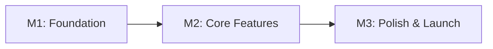

# [Project name] - [version]

[Full Summary of the app and features we are willing to code.]

## 1. Executive Summary

### Problem

[What problem are we solving?]

### Solution

[What are we building?]

### Success Criteria

[How do we know we've succeeded?]

## 2. User Personas

### Primary Persona: [Name]

| Attribute                 | Description                   |
| ------------------------- | ----------------------------- |
| **Role**                  | [Job title or user type]      |
| **Goals**                 | [What they want to achieve]   |
| **Motivations**           | [Why they use the product]    |
| **Frustrations**          | [Current pain points]         |
| **Technical Environment** | [Devices, tools, constraints] |

### Secondary Persona: [Name]

| Attribute        | Description                 |
| ---------------- | --------------------------- |
| **Role**         | [Job title or user type]    |
| **Goals**        | [What they want to achieve] |
| **Motivations**  | [Why they use the product]  |
| **Frustrations** | [Current pain points]       |

## 3. Goals & Objectives

### Business Goals

- BG1: [Revenue/growth goal]
- BG2: [User acquisition/retention]

### Technical Goals

- TG1: [Performance/scalability]
- TG2: [Security/reliability]

### User Goals

- UG1: [User experience improvement]
- UG2: [Efficiency/productivity gain]

## 4. Core Features

Group of identified features to build:

- **Feature 1**: [Short description]

### [Feature/Module 1]

- FR1.1: [Specific requirement]
- FR1.2: [Specific requirement]

#### User Stories

- As a [user type], I want to [action] so that [benefit]

## 5. Acceptance Criteria

> Define testable criteria for each core feature using the Gherkin format (Given-When-Then).

### Feature 1: [Feature Name]

**Happy Path:**

```gherkin
Scenario: [Description]
  Given [initial context]
  When [action performed]
  Then [expected result]
  And [additional verification]
```

**Error Scenarios:**

```gherkin
Scenario: [Error case description]
  Given [error context]
  When [action that causes error]
  Then [error handling behavior]
```

**Edge Cases:**

- [ ] [Edge case 1]
- [ ] [Edge case 2]

## 6. Non-Goals

> What we are intentionally NOT building in this version. This prevents scope creep.

| Non-Goal    | Rationale                      |
| ----------- | ------------------------------ |
| [Feature X] | [Why we're not building it]    |
| [Feature Y] | [Why it's out of scope]        |
| [Feature Z] | [Why it's explicitly excluded] |

## 7. Non-Functional Requirements

For every given features:

### Performance

- NFR1: [Response time targets]
- NFR2: [Throughput requirements]
- NFR3: [Scalability needs]

### Security

- NFR4: [Authentication/authorization]
- NFR5: [Data protection]
- NFR6: [Compliance requirements]

### Usability

- NFR7: [Accessibility standards (WCAG)]
- NFR8: [Browser/device support]

## 8. Technical Architecture

### Tech Stack

- **Frontend**: [Framework, UI library]
- **Backend**: [Language, framework]
- **Database**: [Type, specific system]
- **Infrastructure**: [Cloud, containers]
- **External Services**: [APIs, SaaS]

### Data Model

```
[Key entities and relationships]
[Data flow diagram if needed]
```

### Integration Points

- **Internal APIs**: [List]
- **External APIs**: [List with rate limits]
- **Data Sources**: [Databases, files, streams]

## 9. User Experience

### Information Architecture

[Site map or app structure]

### Key User Flows

1. [Primary flow description]
2. [Secondary flow description]

### Design System

- **Visual**: [Colors, typography, spacing]
- **Components**: [Reusable UI elements]
- **Patterns**: [Interaction patterns]
- **Responsive**: [Breakpoints, mobile-first?]

## 10. Success Metrics

### Business KPIs

| Metric     | Current    | Target   | Date   |
| ---------- | ---------- | -------- | ------ |
| [Metric 1] | [Baseline] | [Target] | [Date] |
| [Metric 2] | [Baseline] | [Target] | [Date] |

### Technical KPIs

| Metric          | Current    | Target   |
| --------------- | ---------- | -------- |
| [Response time] | [Baseline] | [Target] |
| [Uptime]        | [Baseline] | [Target] |

### User KPIs

| Metric              | How Measured | Target   |
| ------------------- | ------------ | -------- |
| [User satisfaction] | [Method]     | [Target] |
| [Task completion]   | [Method]     | [Target] |

## 11. Dependencies

> External dependencies that must be resolved or coordinated.

### Technical Dependencies

| Dependency           | Owner         | Status              | Risk              |
| -------------------- | ------------- | ------------------- | ----------------- |
| [API from Team X]    | [Team/Person] | [Available/Pending] | [High/Medium/Low] |
| [Database migration] | [Team/Person] | [Status]            | [Risk level]      |

### External Dependencies

| Dependency         | Provider   | Status              | Fallback        |
| ------------------ | ---------- | ------------------- | --------------- |
| [Third-party API]  | [Provider] | [Available/Pending] | [Alternative]   |
| [SaaS integration] | [Provider] | [Status]            | [Fallback plan] |

## 12. Experiments / A/B Testing

> Hypotheses to validate and experiments to run.

| Hypothesis                        | Experiment             | Metric            | Success Criteria     |
| --------------------------------- | ---------------------- | ----------------- | -------------------- |
| [If we do X, then Y will improve] | [A/B test description] | [Metric to track] | [Target improvement] |
| [Users prefer X over Y]           | [Test approach]        | [Metric]          | [Success threshold]  |

### Experiment Plan

- **Phase 1**: [% of users] - [Duration]
- **Phase 2**: [% of users] - [Duration]
- **Full rollout criteria**: [Conditions for 100% rollout]

## 13. Timeline & Milestones

| Milestone  | Objective         | Deliverable       | Target Date | Go/No-Go Criteria     |
| ---------- | ----------------- | ----------------- | ----------- | --------------------- |
| M1: [Name] | [What we achieve] | [What we deliver] | [Date]      | [Criteria to proceed] |
| M2: [Name] | [What we achieve] | [What we deliver] | [Date]      | [Criteria to proceed] |
| M3: [Name] | [What we achieve] | [What we deliver] | [Date]      | [Criteria to proceed] |

### Critical Path



## 14. Risks & Mitigations

| Risk             | Probability     | Impact          | Mitigation Plan         | Owner    |
| ---------------- | --------------- | --------------- | ----------------------- | -------- |
| [Technical risk] | High/Medium/Low | High/Medium/Low | [How to prevent/handle] | [Person] |
| [Business risk]  | High/Medium/Low | High/Medium/Low | [How to prevent/handle] | [Person] |
| [Timeline risk]  | High/Medium/Low | High/Medium/Low | [How to prevent/handle] | [Person] |

### Contingency Plans

- **If [Risk 1] occurs**: [Contingency action]
- **If [Risk 2] occurs**: [Contingency action]

## 15. Scope Boundaries (3 Tiers)

### Tier 1 — MVP (Must Have)

> What is included in the first release.

| Feature     | Rationale      |
| ----------- | -------------- |
| [Feature 1] | [Why it's MVP] |
| [Feature 2] | [Why it's MVP] |

### Tier 2 — Next Release (Should/Could Have)

> What is explicitly deferred to V2. Each feature has a promotion trigger.

| Feature     | Rationale      | Promotion Trigger                          |
| ----------- | -------------- | ------------------------------------------ |
| [Feature X] | [Why deferred] | [Metric or condition to promote to Tier 1] |
| [Feature Y] | [Why deferred] | [Metric or condition]                      |

### Tier 3 — Never (Won't Have)

> What we will never build.

| Feature          | Rationale   |
| ---------------- | ----------- |
| [Anti-pattern X] | [Why never] |
| [Anti-pattern Y] | [Why never] |

---

## Appendix

### Glossary

- **Term**: Definition
- **Acronym**: Full meaning

### References

- [Related documents]
- [Design mockups]
- [Technical specs]

### Open Questions

- [ ] [Question needing answer]
- [ ] [Decision to be made]

---

**Team**: [Size/roles]
**Timeline**: [Total duration]
**Priority**: [Critical/High/Medium/Low]
**Status**: [Draft/Approved/In Progress]
