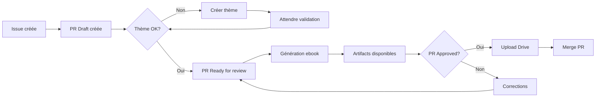

# 📚 Workflow CI/CD de Génération d'Ebook

## Vue d'ensemble

Ce workflow permet de générer automatiquement des ebooks à partir d'issues GitHub, avec validation des thèmes, génération PDF, et upload vers Google Drive.

## 🚀 Utilisation

### 1. Créer une issue

1. Allez dans l'onglet "Issues" du repository
2. Cliquez sur "New Issue"
3. Sélectionnez le template "Génération Ebook Mensuelle"
4. Remplissez le formulaire :
   - Titre du livre
   - Thème (existant ou nouveau)
   - Nombre de pages (24-30)
   - Public cible
   - Langue
   - Instructions spéciales (optionnel)
5. Cochez toutes les confirmations
6. Créez l'issue

### 2. Workflow automatique

Le workflow se déclenche automatiquement :

1. **Initialisation** : Parse l'issue et crée une PR draft
2. **Validation du thème** :
   - Si le thème existe → continue
   - Si nouveau thème → crée le fichier et attend validation
3. **Génération** : Une fois la PR passée en "Ready for review"
4. **Upload** : Après approbation de la PR → upload vers Drive
5. **Finalisation** : Merge la PR et ferme l'issue

## 🔄 États du workflow



## 🧪 Tests locaux

### Prérequis

```bash
# Installer les dépendances
pip install PyYAML requests google-auth google-api-python-client jsonschema

# Configurer les variables d'environnement
export GITHUB_TOKEN="your-github-token"
export GITHUB_REPOSITORY="owner/repo"
export GOOGLE_CREDENTIALS_PATH="path/to/credentials.json"
```

### Commandes de test

```bash
# Tester le parsing d'une issue (simulé)
make ci-parse-issue ISSUE=123

# Valider un thème
make ci-validate-theme SPEC=specs/ebook-123.yaml PR=456

# Générer un ebook (dry run)
make ci-generate-dry SPEC=specs/ebook-123.yaml

# Pipeline complet en local
make ci-pipeline ISSUE=123

# Nettoyer les artifacts
make ci-clean
```

## 📁 Structure des fichiers

```
backoffice/
├── .github/
│   ├── ISSUE_TEMPLATE/
│   │   └── ebook-generation.yml      # Template d'issue
│   └── workflows/
│       └── ebook-generation.yml      # Workflow GitHub Actions
├── scripts/ci/
│   ├── parse_issue.py                # Parse issue → spec YAML
│   ├── validate_theme.py             # Valide/crée les thèmes
│   ├── generate_ebook.py             # Génère l'ebook
│   └── upload_to_drive.py            # Upload vers Google Drive
├── specs/                            # Spécifications générées
│   └── ebook-123.yaml
├── themes/                           # Bibliothèque de thèmes
│   ├── schema.json                   # Schéma de validation
│   ├── christmas.yaml
│   └── animals.yaml
└── dist/                             # Artifacts générés (gitignored)
    ├── interior.pdf
    ├── cover.pdf
    ├── kdp-package.zip
    ├── preview.pdf
    ├── costs.json
    └── provenance.json
```

## 🎨 Gestion des thèmes

### Structure d'un thème

```yaml
name: christmas
description: Thème festif de Noël
color_palette:
  primary: "#C41E3A"
  secondary: "#165B33"
  accent: "#FFD700"
visual_style: festif, traditionnel, chaleureux
base_prompts:
  cover: "Prompt pour la couverture..."
  content: "Prompt pour les pages de contenu..."
metadata:
  created_via: github-issue-123
  approved_by: username
  created_at: "2025-10-13"
```

### Création d'un nouveau thème

1. Sélectionnez "[NOUVEAU] Créer un nouveau thème" dans l'issue
2. Décrivez le style visuel souhaité
3. Le workflow créera automatiquement un fichier thème
4. Un reviewer doit approuver le thème avant la génération

## 📊 Métriques et coûts

Chaque génération produit :
- `costs.json` : Détail des coûts (tokens, USD)
- `provenance.json` : Traçabilité complète (seed, durée, modèles)

### Exemple de rapport de coût

```json
{
  "tokens": 50000,
  "estimated_usd": 0.25,
  "details": [
    {
      "step": "generation",
      "tokens": 50000,
      "cost": 0.25
    }
  ]
}
```

## 🔐 Secrets GitHub requis

Configurez ces secrets dans Settings → Secrets → Actions :

- `GITHUB_TOKEN` : Automatiquement fourni par GitHub Actions
- `OPENROUTER_API_KEY` : Clé API OpenRouter
- `GEMINI_API_KEY` : Clé API Google Gemini
- `GOOGLE_DRIVE_CREDENTIALS` : Credentials du service account (JSON complet)

## 📂 Organisation Google Drive

Les ebooks sont organisés par date :

```
Google Drive/
└── Ebooks/
    └── 2025/
        └── 10-Octobre/
            └── ebook-123-christmas/
                ├── interior.pdf
                ├── cover.pdf
                ├── kdp-package.zip
                ├── preview.pdf
                ├── metadata.json
                └── provenance.json
```

## ⚠️ Limitations

- **Une seule génération à la fois** (pas de parallélisation)
- **Artifacts GitHub** : Conservation 14 jours
- **Quotas API** : Vérifier les limites mensuelles
- **Taille des PDFs** : Max 100MB par fichier sur Drive

## 🆘 Dépannage

### Issue non traitée
- Vérifier que le label `ebook-generation` est présent
- Vérifier les logs du workflow dans l'onglet Actions

### Thème non validé
- S'assurer qu'un reviewer a approuvé le thème
- Vérifier que le fichier thème respecte le schéma JSON

### Échec de génération
- Consulter les logs dans GitHub Actions
- Vérifier les clés API dans les secrets
- S'assurer que les quotas ne sont pas dépassés

### Upload Drive échoué
- Vérifier les credentials du service account
- S'assurer que le compte a les permissions d'écriture
- Vérifier l'espace disponible sur Drive

## 📈 Améliorations futures

- [ ] Support de multiples générations en parallèle
- [ ] Preview en temps réel pendant la génération
- [ ] Estimation des coûts avant génération
- [ ] Retry automatique en cas d'échec
- [ ] Dashboard de suivi des générations
- [ ] Intégration Slack pour notifications