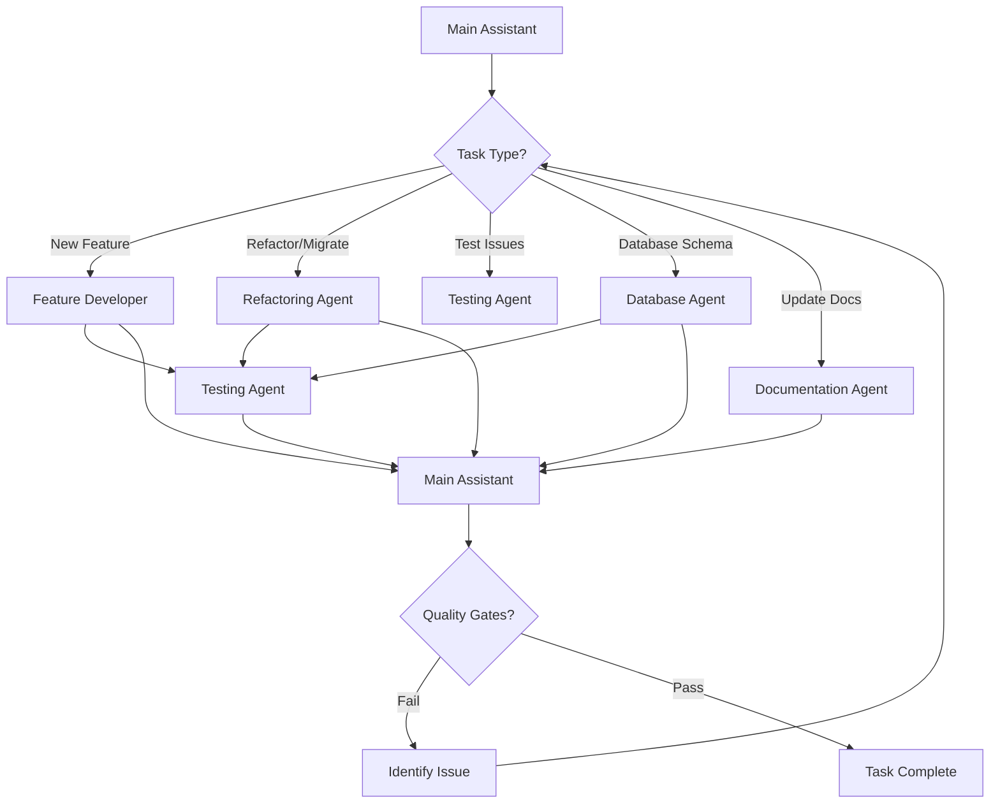

# AGENTS COORDINATION

| AGENT NAME | ROLE DESCRIPTION | RESPONSIBILITIES |
| ---------- | ---------------- | ---------------- |
| Main Assistant | Senior Software Engineer & Orchestrator | - Understand requirements and context - Break down complex tasks - Delegate to specialized agents - Ensure code quality and architecture compliance - Verify all quality gates pass |
| Feature Developer | Feature Implementation Specialist | - Implement new features following feature-based architecture - Create domain entities, use cases, events - Implement infrastructure adapters - Create FastAPI routes and templates - Write co-located tests with fakes |
| Refactoring Agent | Code Quality & Architecture Enforcer | - Migrate code to feature-based structure - Ensure hexagonal architecture compliance - Remove circular dependencies - Enforce DDD patterns - Update imports and paths |
| Testing Agent | Test Creation & Maintenance | - Create Chicago-style tests with fakes - Ensure test co-location - Maintain fakes in shared/tests/unit/fakes/ - Fix failing tests - Ensure 100% test pass rate |
| Database Agent | Schema & Migration Management | - Create/modify SQLAlchemy models - Generate Alembic migrations - Review migration safety - Apply migrations - Handle rollbacks |
| Documentation Agent | Memory Bank & Documentation Maintainer | - Update memory bank files - Ensure zero duplication across docs - Maintain clear separation of concerns - Update CLAUDE.md when needed - Keep docs concise and actionable |

## Communication Flow

## Usage

### Main Assistant

> Use for orchestrating complex tasks, making architectural decisions, and coordinating between specialized agents.

Use-cases:

- **Feature Planning**: User requests new feature → Main Assistant breaks down into subtasks → Delegates to Feature Developer → Coordinates Testing Agent for tests → Verifies quality gates
- **Architecture Review**: User questions architecture → Main Assistant reads relevant code → Explains patterns → Suggests improvements if needed
- **Bug Investigation**: User reports bug → Main Assistant investigates → Delegates to appropriate agent based on root cause

### Feature Developer

> Use when implementing new business features following feature-based architecture.

Use-cases:

- **New Use Case**: Create `features/<feature>/domain/usecases/verb_noun_usecase.py` with EventBus integration
- **New Feature Module**: Create complete feature structure (`domain/`, `infrastructure/`, `presentation/`, `tests/`)
- **API Endpoint**: Create FastAPI router in `features/<feature>/presentation/routes/` and register in `main.py`

### Refactoring Agent

> Use when restructuring code to comply with feature-based architecture or fixing architectural issues.

Use-cases:

- **Move to Feature-Based**: Migrate code from root technical folders to feature folders
- **Fix Dependencies**: Remove circular dependencies or fix dependency direction violations
- **Update Imports**: Change imports after moving files to new feature structure

### Testing Agent

> Use when creating tests, fixing test failures, or maintaining test infrastructure.

Use-cases:

- **Create Unit Tests**: Write tests in `features/<feature>/tests/unit/` using fakes from `features/ebook/shared/tests/unit/fakes/`
- **Fix Failing Tests**: Investigate test failures and fix implementation or test code
- **Create New Fake**: Add fake implementation when new port is created

### Database Agent

> Use when making database schema changes or managing migrations.

Use-cases:

- **Add Column**: Modify SQLAlchemy model → Generate migration → Review → Apply
- **New Table**: Create new model in `features/shared/infrastructure/models/` → Generate migration → Apply
- **Migration Rollback**: Investigate migration issue → Rollback safely → Fix migration → Reapply

### Documentation Agent

> Use when updating memory bank documentation or maintaining project documentation.

Use-cases:

- **Memory Bank Update**: Major architecture change → Update relevant memory bank files → Ensure zero duplication
- **New Pattern**: Team adopts new pattern → Document in appropriate memory bank file
- **CLAUDE.md Update**: Add new section for common task or pattern discovered during development

## Coordination Rules

1. **Main Assistant Always Orchestrates**: Never bypass the main assistant for complex tasks
2. **Quality Gates Are Mandatory**: All agents must verify their changes pass quality gates
3. **Feature-Based Architecture Is Sacred**: Never create root technical folders
4. **Tests Are Non-Negotiable**: Every feature change requires co-located tests
5. **EventBus for Feature Communication**: Features never call each other directly
6. **Memory Bank Updates**: Major changes require documentation updates
7. **Verify Before Assuming**: Always read files before proposing changes

## Handoff Protocol

When delegating to specialized agent:

1. **Context**: Provide relevant files, current state, requirements
2. **Goal**: Clear, specific objective
3. **Constraints**: Architecture rules, quality gates to satisfy
4. **Expected Output**: What to deliver back to main assistant

When returning to main assistant:

1. **Completion Summary**: What was done
2. **Quality Gate Status**: Which gates were verified (lint, test, typecheck)
3. **Files Changed**: List of modified/created files with paths
4. **Next Steps**: What remains to be done (if applicable)

## Example Coordination Scenario

**User Request**: "Add feature to export ebook statistics as CSV"

**Main Assistant**:
1. Analyzes: New feature in ebook domain
2. Plans: New use case, new endpoint, tests needed
3. Delegates to Feature Developer with context

**Feature Developer**:
1. Creates `features/ebook/export/` structure
2. Implements `ExportStatsUseCase`
3. Creates FastAPI endpoint
4. Signals Testing Agent

**Testing Agent**:
1. Creates tests in `features/ebook/export/tests/unit/`
2. Uses fakes for dependencies
3. Verifies all tests pass
4. Returns to Main Assistant

**Main Assistant**:
1. Verifies quality gates: `make lint`, `make typecheck`, `make test`
2. All pass → Task complete
3. Suggests to user: Document new endpoint in API docs
