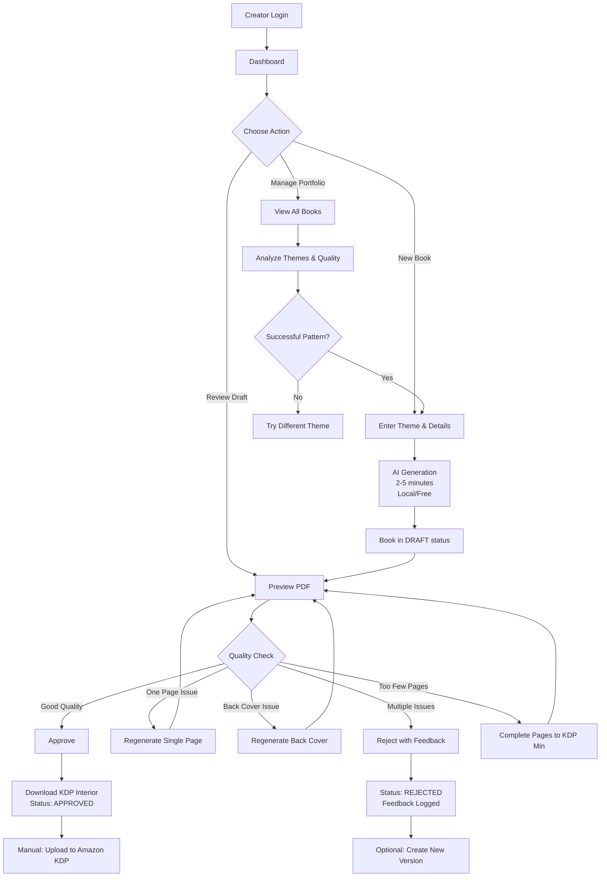

# PROJECT_BRIEF.md

## Executive Summary

- **Project Name**: Ebook Generator - Amazon KDP Coloring Books
- **Vision**: Enable anyone to publish professional coloring books on Amazon without manual illustration
- **Mission**: Democratize coloring book creation by automating the entire production workflow from concept to KDP-ready PDF

### Full Description

This backoffice empowers content creators to generate professional coloring books ready for Amazon KDP (Kindle Direct Publishing) print-on-demand sales. It eliminates the need for manual illustration by automating the complete production workflow: generating themed illustrations, converting to line art suitable for coloring, creating covers with titles, and assembling KDP-compliant PDFs. The system handles quality validation through an editorial workflow.

**Problem Solved**: Creating a coloring book traditionally requires hiring illustrators, spending weeks on manual work, learning print specifications, and understanding Amazon's technical requirements. This tool reduces that to minutes and requires no artistic or technical expertise.

**User Value**: A non-artist can generate a 24-30 page coloring book about dinosaurs, pirates, or unicorns in under 5 minutes, ready to upload to Amazon for worldwide print-on-demand sales.

## Context

### Target Users

**Primary**: Solo entrepreneurs and small publishers wanting to enter the Amazon KDP coloring book market without upfront illustration costs or artistic skills.

**Secondary**: Content creators testing coloring book concepts before investing in professional illustration.

### Business Model

- Generate coloring books for Amazon KDP print-on-demand using free, local AI models
- Enable rapid iteration and testing of different themes
- Support both children's (simple) and adult (detailed) markets
- Zero per-book generation costs (fully local processing)

### Core Domain

**Print-on-Demand Publishing Automation** - The system bridges AI-generated imagery with Amazon's strict printing specifications by automating the transformation of creative concepts into commercially-ready coloring book products.

**Key Differentiator**: End-to-end automation from theme prompt to KDP-compliant PDF, including editorial quality gates and flexible regeneration capabilities.

### Ubiquitous Language

| Term | Definition |
| -------- | -------------- |
| **Ebook** | A complete coloring book project containing cover, content pages, back cover, and assembled PDF |
| **Theme** | Subject matter for the book (dinosaurs, pirates, unicorns, christmas-creepy-cute, etc.) |
| **Audience** | Target market segment - Children (simple, thick lines) or Adults (detailed, intricate) |
| **Line Art** | Black & white outline illustrations suitable for coloring (converted from color images) |
| **KDP** | Kindle Direct Publishing - Amazon's print-on-demand self-publishing platform |
| **Generation** | AI-powered creation of images from text prompts |
| **Seed** | Reproducible number that ensures identical generation results when repeated |
| **Validation** | Editorial review process where books move from DRAFT to APPROVED/REJECTED status |
| **Content Page** | Interior black & white illustration page for coloring |
| **Back Cover** | Rear cover of the book, displayed as line art (text removed from cover design) |
| **Bleed** | Extra margin around pages required by printers for trimming (0.125" per side) |
| **Trim Size** | Final physical dimensions of the printed book (8.0" × 10.0") |
| **DPI** | Dots Per Inch - resolution requirement for print quality (Amazon requires 300 DPI) |
| **Editorial Workflow** | Quality gates ensuring books meet standards before approval for publication |
| **Interior** | Content pages only (excluding cover and back cover) for KDP manuscript upload |
| **Manuscript** | KDP term for the interior-only PDF file (content pages without cover) |
| **Page Completion** | Adding blank pages to reach KDP minimum requirements (24 interior pages) |

## Use-cases

### Core Features

**Book Generation (Happy Path)**
- Creator enters book theme (e.g., "pirate adventure")
- Creator selects audience (children vs adults - determines complexity)
- Creator specifies page count (24-30 pages)
- System generates full-color cover with title
- System generates all content pages as line art for coloring
- System generates back cover (line art version)
- System assembles complete KDP-compliant PDF
- Creator previews result in browser
- Creator approves for publication
- System uploads to Google Drive (optional)

**Quality Management**
- Dashboard shows all books by status (DRAFT, APPROVED, REJECTED, PUBLISHED)
- Reviewer previews PDF before approval
- Reviewer approves books that meet quality standards
- Reviewer rejects books with issues (unclear lines, poor theme match)
- Reviewer can regenerate back cover if text artifacts remain visible
- Reviewer can regenerate individual content pages with quality issues
- System tracks approval/rejection reasons for learning

**Publishing Workflow**
- DRAFT: Just generated, awaiting review
- APPROVED: Quality validated, ready for Amazon upload
- PUBLISHED: Uploaded to Amazon KDP (manual step outside system)
- REJECTED: Did not meet quality standards

**Advanced Regeneration**
- Regenerate back cover only (if text artifacts visible)
- Regenerate single content page (if quality issues on specific page)
- Complete pages to KDP minimum (add blank pages to reach 24-page requirement)
- Maintain all other pages unchanged during targeted regeneration

**KDP Export Options**
- Preview KDP interior (DRAFT or APPROVED books) in browser
- Download KDP interior PDF (APPROVED books only)
- Interior excludes cover and back cover (manuscript format)
- Automatically adjusts paper type based on page count

## User Journey maps

### Personas

**1. The Entrepreneur (Primary)**
- Solo creator testing the coloring book market
- No artistic skills or illustration budget
- Wants to validate book concepts quickly
- Benefits from zero per-book generation costs
- Goal: Launch 5-10 books on Amazon to test market demand

**2. The Content Publisher (Secondary)**
- Small publishing business creating multiple book series
- Has editorial standards for brand consistency
- Publishes regularly (multiple books per week)
- Scales production without per-book costs
- Goal: Scale coloring book production while maintaining quality

**3. The Editorial Reviewer (Internal)**
- Validates quality before publication approval
- Checks line art clarity, theme consistency, text removal
- Provides feedback on rejections
- Regenerates elements when needed (back cover or specific pages)
- Goal: Maintain brand reputation by ensuring only quality books reach customers

### Journey 1: First-Time Book Creation

**Context**: An entrepreneur discovers the platform and wants to create their first coloring book.

**Steps**:
1. User accesses dashboard (sees stats: 0 books created)
2. User clicks "Create New Ebook"
3. User enters details:
   - Title: "Dinosaur Adventure Coloring Book"
   - Author: "Jane Smith"
   - Theme: "dinosaurs"
   - Audience: "children" (simple, thick lines)
   - Pages: 24 (minimum for KDP)
   - Seed: (optional - left empty for random)
4. User submits → system shows "Generating... 2-5 minutes"
5. User waits (can close browser, generation continues)
6. User receives notification/checks dashboard → book appears in DRAFT status
7. User clicks "Preview PDF" → views full book in browser
8. User reviews:
   - Cover looks good with title clearly visible
   - All 24 content pages have clear, simple dinosaur line art
   - Back cover is clean line art without text
9. User clicks "Approve" → status changes to APPROVED
10. User downloads KDP-ready PDF (interior manuscript)
11. User uploads PDF to Amazon KDP (external workflow)

**Success Criteria**: Book meets KDP specifications, line art is clear enough for coloring.

### Journey 2: Quality Review & Selective Regeneration

**Context**: A reviewer examines a newly generated book and finds a quality issue on one specific page.

**Steps**:
1. Reviewer accesses dashboard → sees 3 books in DRAFT status
2. Reviewer clicks first book → opens preview
3. Reviewer examines pages:
   - Cover: ✅ Good quality, title readable
   - Content pages 1-20: ✅ Clear line art
   - Content page 21: ❌ Lines too faint/broken
   - Content pages 22-24: ✅ Good quality
   - Back cover: ✅ Clean line art
4. Reviewer clicks "Regenerate Page 21"
5. System regenerates ONLY page 21 with new random seed
6. System reassembles PDF with new page 21
7. Reviewer previews again → page 21 now acceptable
8. Reviewer clicks "Approve" → status changes to APPROVED
9. Book ready for KDP upload without regenerating entire book

**Success Criteria**: Only problematic page is regenerated, saving time and API costs.

### Journey 3: Portfolio Management

**Context**: A publisher manages multiple books and analyzes quality patterns.

**Steps**:
1. Publisher accesses dashboard → sees 12 books total
2. Publisher reviews book status distribution:
   - APPROVED: 8 books
   - REJECTED: 3 books
   - DRAFT: 1 book
3. Publisher filters by "APPROVED only"
4. Publisher reviews approved books to identify successful themes
5. Publisher identifies: Dinosaurs (3 books) and Ocean Life (2 books) have highest approval rate
6. Publisher decides to expand successful themes
7. Publisher creates 3 more dinosaur-themed books
8. Publisher maintains consistent style using seed values

**Success Criteria**: Publisher identifies quality patterns and scales production of successful themes.

### Journey 4: Rapid Theme Testing

**Context**: An entrepreneur wants to test which themes sell better on Amazon.

**Steps**:
1. Creator decides to test 3 themes: dinosaurs, pirates, unicorns
2. Creator generates all 3 books (same day):
   - Book A: "Dinosaur Adventures" - 24 pages, children audience
   - Book B: "Pirate Treasures" - 24 pages, children audience
   - Book C: "Magical Unicorns" - 24 pages, children audience
3. All 3 books use seed values for reproducibility
4. Creator reviews all 3 PDFs → approves all
5. Creator downloads KDP interior PDFs for all 3
6. Creator uploads all 3 to Amazon KDP
7. After 2 weeks, creator checks Amazon sales
8. Dinosaurs book sells best → creator decides to create "Dinosaurs Vol 2"
9. Creator uses same seed + different prompt for consistent style
10. Creator expands dinosaur series to 5 books

**Success Criteria**: Fast iteration enables market testing, seed values ensure series consistency.

### Journey 5: Testing KDP Requirements with Page Completion

**Context**: A creator wants to test KDP export quickly with minimal generation time.

**Steps**:
1. Creator generates short test book with only 3 content pages
2. Creator uses "Complete Pages" feature to add blank pages to reach 24 interior pages
3. System adds 21 blank white pages between last content page and back cover
4. System reassembles PDF with all 26 total pages (cover + 24 interior + back cover)
5. Creator previews KDP interior export (24 interior pages only)
6. Creator verifies export meets KDP specifications
7. Creator approves book and downloads KDP interior manuscript
8. Creator successfully uploads to Amazon KDP

**Success Criteria**: Creator can test KDP export workflow without waiting for full book generation.

## Requirements & Constraints

### Business Requirements

**KDP Compliance (Non-Negotiable)**
- Trim size: 8.0" × 10.0" (203mm × 254mm)
- Bleed: 0.125" (3.175mm) on all sides
- Resolution: 300 DPI minimum for print quality
- Page count: 24-30 pages minimum (KDP requires 24 interior pages)
- File format: PDF
- Interior manuscript: Content pages only (no cover/back cover)

**Quality Standards**
- Line art must be clear and continuous (no broken lines)
- Lines must be thick enough for coloring (children books: thicker, adults: medium)
- Cover must include book title prominently
- Back cover must not contain readable text
- All content must match stated theme consistently

### Audience Requirements

**Children's Books**
- Simple illustrations with minimal detail
- Thick, clear lines easy to color within
- Themes: animals, adventure, fantasy, seasonal (dinosaurs, pirates, unicorns, christmas-creepy-cute)
- Complexity: Low

**Adult Books**
- Detailed, intricate illustrations
- Medium line width for precision coloring
- Themes: mandalas, nature, geometric patterns
- Complexity: High (stress relief, art therapy focus)

### Operational Requirements

**Editorial Workflow**
- All books start as DRAFT (not automatically approved)
- Reviewer must explicitly approve before publication
- Rejected books include feedback for learning
- Back cover can be regenerated if quality issues detected
- Individual content pages can be regenerated if quality issues detected
- Books can be completed to KDP minimum page count with blank pages

**Performance Expectations**
- Generation time: 2-5 minutes for complete book
- Preview: Instant in-browser PDF viewing
- Dashboard: Real-time status updates
- Regeneration: Single page regeneration faster than full book (30-60 seconds)

**Storage**
- Generated PDFs stored locally
- Optional automatic upload to Google Drive
- PDF files preserved for re-download after approval

## Success Metrics

### Creator Value
- Time saved: 24-page book in 5 minutes vs weeks of manual work
- Zero generation costs: Fully local processing with free AI models
- No artistic skills required: AI handles all illustration
- Unlimited iterations: Test themes freely without per-book costs
- Selective regeneration: Fix single pages without regenerating entire book

### Quality Assurance
- Approval rate: Target 80%+ books pass quality review on first attempt
- Rejection reasons: Track common issues to improve generation
- Theme consistency: All pages match stated theme
- Regeneration efficiency: Single page fixes reduce waste (90%+ of book preserved)

### Business Viability
- KDP compliance: 100% of approved books must meet Amazon specs
- Iteration speed: Enable testing 5+ themes per day per creator
- Theme discovery: Identify successful patterns through rapid testing
- Export flexibility: Support both full book and interior-only manuscript formats
