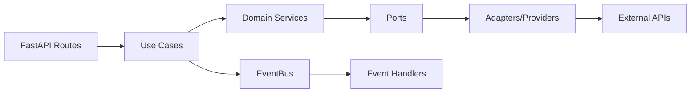

# Stack

## Backend

@pyproject.toml

### Core Framework
- Python 3.11
- FastAPI 0
- Pydantic 2
- Uvicorn (ASGI server)

### Architecture & Patterns
- Hexagonal (Ports & Adapters)
- DDD (Domain-Driven Design)
- Event-Driven (EventBus with asyncio)
- Feature-Based (Screaming Architecture)
- Dependency Inversion

### Database
- PostgreSQL
- SQLAlchemy 2 (sync only)
- Alembic 1 (migrations) → @src/backoffice/migrations/

### Templating & Web
- Jinja2 3 (ChoiceLoader for multi-feature templates)
- HTMX (frontend interactivity)
- TailwindCSS (styling)

### Testing
- pytest 7
- Playwright 1 (E2E tests)
- testcontainers 4 (PostgreSQL integration tests)
- Chicago-style testing (fakes over mocks) → @features/ebook/shared/tests/unit/fakes/

### AI & Image Processing
- openai 1 (OpenRouter SDK)
- httpx 0 (HTTP client for external APIs)
- Pillow 10 (image manipulation)
- img2pdf 0 (PDF generation)
- WeasyPrint 61 (HTML/CSS to PDF)
- ImageCms (ICC profile conversion)

### Configuration & Utilities
- PyYAML 6 (theme configuration)
- python-dotenv 1 (environment variables)
- python-multipart 0 (file uploads)
- aiofiles 23 (async file I/O)

### Code Quality
- ruff 0 (linting & formatting) → @pyproject.toml
- mypy 1 (type checking) → @pyproject.toml
- vulture 2 (dead code detection) → @pyproject.toml
- deptry 0 (dependency analysis) → @pyproject.toml
- pre-commit 3 (git hooks) → @.pre-commit-config.yaml

### External Services Integration
- google-api-python-client 2 (Google Drive)
- google-auth 2 (service account)
- websocket-client (ComfyUI WebSocket)

### Image Generation Providers
Located at @features/ebook/shared/infrastructure/providers/images/
- OpenRouter (Gemini 2.5 Flash via OpenRouter API)
- Gemini Direct (Google Gemini API)
- ComfyUI (local Stable Diffusion via WebSocket)

### Publishing Providers
Located at @features/ebook/shared/infrastructure/providers/publishing/kdp/
- Interior Assembly → @assembly/interior_assembly_provider.py
- Cover Assembly → @assembly/cover_assembly_provider.py
- KDP Utils → @utils/
  - Barcode Utils → @barcode_utils.py
  - Spine Generator → @spine_generator.py
  - Color Utils → @color_utils.py (RGB→CMYK with ICC profiles)
  - Visual Validator → @visual_validator.py

## Data Flow Architecture

## Core Patterns Details

### Hexagonal Architecture
- Domain at center (NO external dependencies)
- Ports define interfaces (ABC)
- Adapters implement ports
- Dependency flow: `presentation → infrastructure → domain`

### DDD
- Entities: `Ebook`, `ImagePage`, `ThemeProfile`
- Value Objects: `CreationRequest`, `ImageSpec`, `Pagination`
- Use Cases: Command/query handlers
- Domain Events: Published via EventBus
- Repositories: Data access abstraction

### Event-Driven
- EventBus: In-memory pub/sub with asyncio → @features/shared/infrastructure/events/
- Thread-safe concurrent handler execution
- Handlers registered per event type
- Features communicate via events (NOT direct calls)

### Feature-Based (Screaming Architecture)
- Each feature = DDD Bounded Context
- All code (domain, infra, presentation, tests) in feature folder
- NO root technical folders
- Shared code only if used by 2+ features

### Chicago-style Testing
- Fakes (simplified real implementations) instead of mocks
- Located at @features/ebook/shared/tests/unit/fakes/
- Examples: `FakeCoverPort`, `FakePagePort`, `FakeAssemblyPort`

## Security & Authentication
- JWT (authentication tokens)
- Pydantic (input validation)
- SQLAlchemy ORM (SQL injection prevention)
- Bandit security rules (ruff S rules)
- No authentication (internal backoffice tool)
