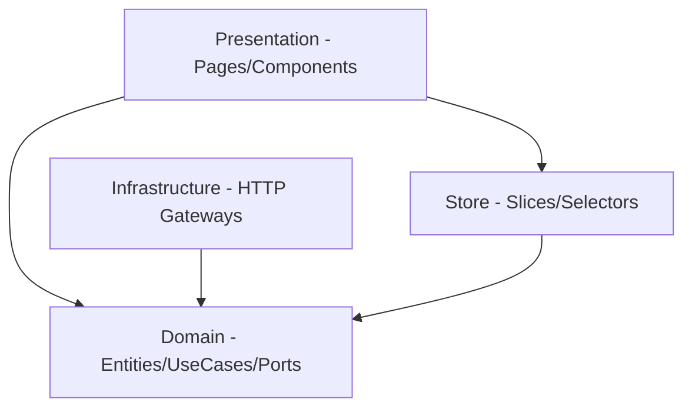
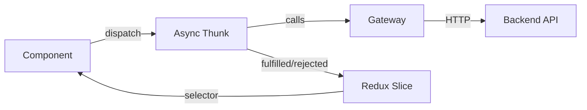

# Architecture

## Patterns Used

- **Hexagonal Architecture** (Ports & Adapters): Mirrors backend pattern
- **Feature-Based (Screaming) Architecture**: Business features as top-level folders
- **Redux Toolkit**: Centralized state with async thunks
- **Gateway Injection**: Gateways passed via Redux `thunk.extraArgument` for DI

## Layer Dependencies



- Presentation depends on store (hooks) and domain (types)
- Infrastructure implements domain ports
- Store dispatches domain use cases
- Domain has ZERO dependencies

## State Flow



## Gateway Injection

- `main.tsx` creates real gateway instances (`HttpEbookGateway`, etc.)
- Gateways bundled in `Gateways` interface
- Passed to Redux store via `thunk: { extraArgument: gateways }`
- Thunks access via `extra` parameter: `const { ebookGateway } = extra as Gateways`
- Tests swap with fakes -- no HTTP calls

## Store Structure

```
{
  ebooks: { items, currentEbook, stats, formConfig, pagination, statusFilter, loading, error }
  regeneration: { progress, editModal, pageData, preview }
}
```

- `ebook-slice`: CRUD, listing, stats, form config
- `regeneration-slice`: Image editing, preview, progress tracking, `restorePreview` reducer for undo

## Use Cases (Async Thunks)

| File | Thunks |
|------|--------|
| `ebook-usecases.ts` | `listEbooks`, `getEbookDetail`, `createEbook`, `fetchFormConfig` |
| `export-usecases.ts` | `exportEbook`, `fetchKdpCoverPreview`, `fetchPageImage` |
| `regeneration-usecases.ts` | `fetchPageData`, `previewRegenerate`, `editPage`, `applyEdit`, `previewRegenerateCover`, `editCover`, `applyCoverEdit` |

## Naming Conventions

| Type | Pattern | Example |
|------|---------|---------|
| Gateway interfaces | `NounGateway` | `EbookGateway`, `ExportGateway` |
| HTTP implementations | `HttpNounGateway` | `HttpEbookGateway` |
| Use cases (thunks) | `verbNoun` | `listEbooks`, `createEbook` |
| Slices | `noun-slice.ts` | `ebook-slice.ts` |
| Selectors | `selectNoun` | `selectEbooks`, `selectLoading` |
| Fakes | `FakeNounGateway` | `FakeEbookGateway` |
| Pages | `NounPage.tsx` | `DashboardPage.tsx` |
| Components | `NounVerb.tsx` | `CreateEbookModal.tsx` |

## Error Handling

- HTTP errors: gateway throws, thunk `.rejected` catches
- Redux: `state.error` string on rejection
- UI: `showToast('error', message)` via CustomEvent

## Key Decisions

- No RTK Query -- gateways handle HTTP (hexagonal purity)
- No form library -- manual `useState` for simple forms
- Native `<dialog>` for modals
- Lazy page data loading (no base64 in list responses)
- Toast via CustomEvent (no external library)
- Components access gateways ONLY via Redux thunks, never direct `fetch()`
